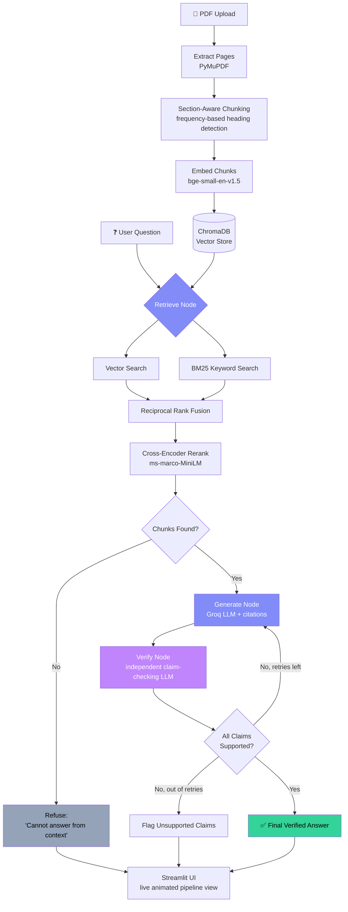

<!-- ============================================================= -->
<!-- Paste everything below into your repo's README.md            -->
<!-- ============================================================= -->

<div align="center">

# 📄 ScholarCite RAG

### A Citation-Grounded, Self-Verifying RAG Assistant for Academic Documents


-F55036)


**[🔗 Live Demo](http://52.64.241.245:8501)** · **[📊 Evaluation Methodology](#evaluation-results)** · **[🏗️ Architecture](#architecture)**

</div>

---

## Overview

ScholarCite RAG is a retrieval-augmented generation system purpose-built
for academic documents — research papers, textbook chapters, lecture
notes. A user uploads a PDF and asks questions in natural language; the
system retrieves the exact supporting passages, generates an answer
strictly from that retrieved text, cites the precise page and section
for every claim, and then runs a **second, independent verification
pass** that checks each claim against the source before the answer is
ever shown.

The project was built end-to-end — ingestion, hybrid retrieval,
self-verification, quantified evaluation, a live UI, and a production
deployment — entirely on a free and open-source stack, with every
architectural decision validated through real adversarial testing
rather than assumed.

---

## Pipeline, Stage by Stage

| Stage | What it does | Technology |
|---|---|---|
| **1 · Ingestion** | Extracts text per page from the PDF and splits it into section-aware chunks, each tagged with its exact page number and section name. Section detection uses a layered approach — known academic headers, numbered subsections, and a generalizable frequency-based heuristic that identifies genuine headings in *any* document without a fixed vocabulary. | PyMuPDF, custom chunking logic |
| **2 · Embedding + Indexing** | Converts each chunk into a dense vector and stores it in a persistent, per-document vector collection. | `BAAI/bge-small-en-v1.5`, ChromaDB |
| **3 · Hybrid Retrieval** | Runs semantic (vector) search and keyword (BM25) search in parallel, fuses the two ranked lists with Reciprocal Rank Fusion, then re-scores the merged candidates with a cross-encoder for final precision. | `rank_bm25`, `cross-encoder/ms-marco-MiniLM-L-6-v2` |
| **4 · Generation** | Prompts the LLM to answer strictly from the retrieved excerpts, citing `[Page X, Section: Y]` for every claim, and to explicitly refuse when the excerpts don't support an answer. | Groq (`openai/gpt-oss-120b`) |
| **5 · Self-Verification** | A second, independent LLM extracts every factual claim from the generated answer and checks it against the same retrieved excerpts. Unsupported claims trigger a retry with a fresh, wider retrieval pass, or are explicitly flagged if retries are exhausted. | LangGraph state machine, Groq (`openai/gpt-oss-20b`) |
| **6 · Evaluation** | Automated scoring of faithfulness, answer relevancy, context precision, and context recall on a hand-verified test set, with every run's configuration and results logged for comparison. | Ragas, MLflow, LangSmith |
| **7 · Interface** | A chat-style UI with a live, animated visualization of the retrieval → generation → verification pipeline actually executing in real time. | Streamlit |
| **8 · Deployment** | Containerized and deployed to a cloud instance with automated testing on every push. | Docker, GitHub Actions, AWS EC2 |

---

## Pipeline Workflow



---

## Architecture

```
┌─────────────┐     ┌──────────────┐     ┌─────────────────┐
│   Streamlit  │────▶│  LangGraph    │────▶│  Groq (LLM API)  │
│   Frontend   │     │  State Machine│     │  gpt-oss-120b/20b│
└─────────────┘     └──────┬───────┘     └─────────────────┘
                            │
              ┌─────────────┼─────────────┐
              ▼             ▼             ▼
       ┌───────────┐ ┌───────────┐ ┌──────────────┐
       │ ChromaDB  │ │   BM25    │ │ Cross-Encoder │
       │ (Vectors) │ │ (Keyword) │ │  Reranker     │
       └───────────┘ └───────────┘ └──────────────┘
              │             │             │
              └─────────────┴─────────────┘
                            │
                            ▼
              ┌───────────────────────────┐
              │  Ragas · MLflow · LangSmith │
              │   (Evaluation & Tracing)    │
              └───────────────────────────┘
```

---

## Evaluation Results

Evaluated on 8 hand-verified, answerable questions against *"Attention
Is All You Need,"* with every run's configuration and scores logged to
MLflow and every execution traced in LangSmith:

| Metric | Score |
|---|---|
| **Faithfulness** | ~0.88 |
| **Response Relevancy** | ~0.92 |
| **Context Precision** | ~0.98 |
| **Context Recall** | 1.00 |

**Before/after comparison** — hybrid retrieval vs. pure vector search, same test set:

| Metric | Vector-only | Hybrid + Reranking |
|---|---|---|
| Faithfulness | 0.70 | 0.79 |
| Context Recall | 0.80 | 1.00 |
| Context Precision | 0.80 | 0.97 |
| Response Relevancy | 0.76 | 0.96 |

Every metric improved with hybrid retrieval enabled — see
`PROJECT_SUMMARY.md` for full methodology, including how refusal
questions are scored and excluded from these figures.

---

## Setup

```bash
git clone https://github.com/Govindprasad1/ScholarCite-RAG.git
cd ScholarCite-RAG

uv sync
cp .env.example .env   # add your free GROQ_API_KEY from console.groq.com

uv run streamlit run app.py
```

**With Docker:**
```bash
docker build -t scholarcite-rag .
docker run -p 8501:8501 --env-file .env scholarcite-rag
```

**Running tests and evaluation:**
```bash
uv run pytest tests/ -v
uv run python notebooks/run_stage7_eval.py data/uploads/your_paper.pdf
mlflow ui   # view logged experiment runs at localhost:5000
```

---

## Known Limitations

- Section detection can occasionally misattribute footnote/front-matter text that falls between a detected header and the following content.
- Inline subsection headings embedded mid-paragraph (common in dense 2-column academic PDFs) are not always separated from surrounding text — the system correctly refuses rather than answers incompletely in this case.
- No OCR support — assumes text-based (not scanned) PDFs.
- Single-document scope by design — no cross-document synthesis.

Full debugging history and every issue resolved during development is
documented in [`PROJECT_SUMMARY.md`](./PROJECT_SUMMARY.md).

---

## Tech Stack

`Python` `LangChain` `LangGraph` `LangSmith` `Groq` `ChromaDB` `BM25` `sentence-transformers` `Ragas` `MLflow` `Streamlit` `Docker` `GitHub Actions` `AWS EC2` `uv`

<!-- ============================================================= -->
