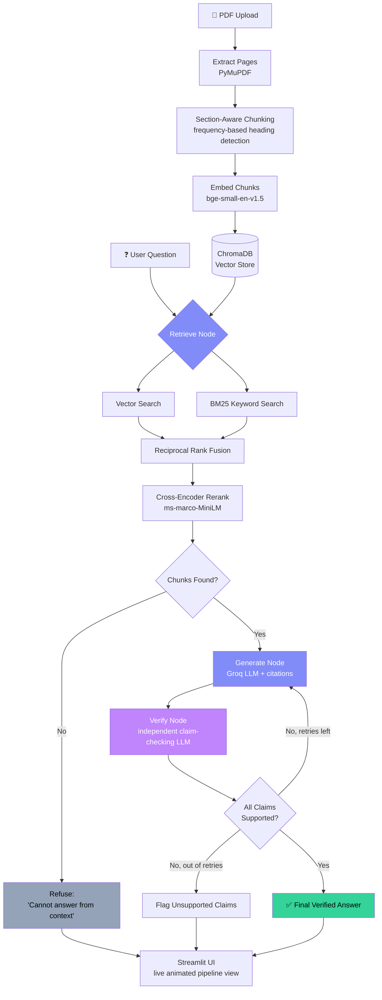

<!-- ============================================================= -->
<!-- Paste everything below into your repo's README.md            -->
<!-- ============================================================= -->

# ScholarCite RAG
### A Citation-Grounded, Self-Verifying RAG Assistant for Academic Documents


Upload a research paper, textbook chapter, or set of notes and ask it
questions. Every answer is generated strictly from the document,
cited down to the exact page and section, and **independently
fact-checked** by a second verification pass before you ever see
it — built end-to-end on a free, open-source stack.

## 🔗 Live Demo
**AWS EC2**: `http://52.64.241.245:8501`

> Deployed on AWS EC2 (`t3.small`, 2GB RAM) rather than HuggingFace
> Spaces or Streamlit Community Cloud, after evaluating both: HF now
> requires a paid tier for Docker/Gradio hosting, and Streamlit
> Cloud's 1GB RAM guarantee is tight for this app's embedding +
> reranker memory footprint. See [Known Limitations](#known-limitations).

---

## Why this is different from "chat with your PDF"

Most RAG demos trust the LLM's first answer. This one doesn't:

1. **Hybrid retrieval** (vector search + BM25, fused with Reciprocal Rank Fusion, then reranked) — proven via adversarial testing to catch exact facts and reject semantically-similar-but-wrong matches that pure vector search misses.
2. **Independent self-verification** — a second LLM call extracts every factual claim from the generated answer and checks it against the retrieved source text before the answer is shown. If a claim isn't supported, the system retries with a wider retrieval pass or flags it explicitly — it never silently ships an unverified claim.
3. **Quantified, not just claimed** — evaluated with [Ragas](https://github.com/explodinggecko/ragas) (Faithfulness, Response Relevancy, Context Precision, Context Recall) and tracked across experiments in MLflow, with full execution traces in LangSmith.

## Pipeline Workflow



## Architecture

| Stage | Component | Technology |
|---|---|---|
| 1 | Ingestion | PyMuPDF, custom frequency-based section chunking |
| 2 | Embeddings + Vector Store | `bge-small-en-v1.5`, ChromaDB |
| 3 | Generation | Groq (`openai/gpt-oss-120b`) |
| 4 | Self-Verification | LangGraph state machine, independent judge LLM |
| 5 | Hybrid Retrieval | BM25 + vector + RRF + cross-encoder reranking |
| 6 | Config-Driven Pipeline | All tunables in `config.yaml` |
| 7 | Evaluation | Ragas, MLflow, LangSmith |
| 8 | UI | Streamlit, live pipeline visualization |
| 9 | Deployment | Docker, GitHub Actions CI, AWS EC2 |

## Evaluation Results

Evaluated on 10 hand-verified questions against *"Attention Is All
You Need"* (2 deliberately unanswerable, to test refusal behavior):

| Metric | All 10 questions | 8 answerable only |
|---|---|---|
| Faithfulness | 0.685 | ~0.88 |
| Response Relevancy | 0.734 | ~0.92 |
| Context Precision | 0.780 | ~0.98 |
| Context Recall | 1.000 | 1.00 |

> Ragas scores a correctly-issued refusal as `0` across all metrics
> (no claims exist to verify), which understates the blended
> 10-question aggregate — restricted to the genuinely answerable
> questions, scores are materially higher. Full methodology in
> `PROJECT_SUMMARY.md`.

Before/after comparison (vector-only vs. hybrid retrieval), logged in MLflow:

| Metric | Vector-only | Hybrid + reranking |
|---|---|---|
| Faithfulness | 0.70 | 0.79 |
| Context Recall | 0.80 | 1.00 |
| Context Precision | 0.80 | 0.97 |
| Response Relevancy | 0.76 | 0.96 |

## Setup

```bash
git clone https://github.com/Govindprasad1/ScholarCite-RAG.git
cd ScholarCite-RAG

uv sync
cp .env.example .env   # add your free GROQ_API_KEY (console.groq.com)

uv run streamlit run app.py
```

Or with Docker:
```bash
docker build -t scholarcite-rag .
docker run -p 8501:8501 --env-file .env scholarcite-rag
```

## Running Tests / Evaluation

```bash
uv run pytest tests/ -v
uv run python notebooks/run_stage7_eval.py data/uploads/your_paper.pdf
mlflow ui   # view logged experiment runs
```

## Known Limitations

- Section detection can occasionally misattribute footnote/front-matter text that falls between a detected header and the following content.
- Inline subsection headings embedded mid-paragraph (common in dense 2-column academic PDFs) are not always separated from surrounding text — the system correctly refuses rather than answers incompletely in this case.
- No OCR support — assumes text-based (not scanned) PDFs.
- Single-document scope by design — no cross-document synthesis.
- See `PROJECT_SUMMARY.md` for the full debugging history and every issue resolved during development.

## Tech Stack

Python · LangChain · LangGraph · LangSmith · Groq · ChromaDB · BM25 ·
sentence-transformers · Ragas · MLflow · Streamlit · Docker · GitHub
Actions · AWS EC2 · `uv`

<!-- ============================================================= -->
